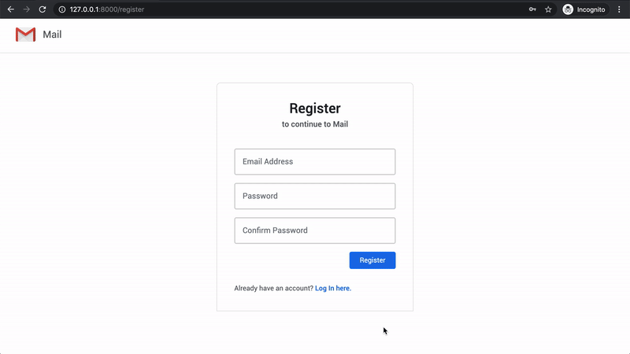
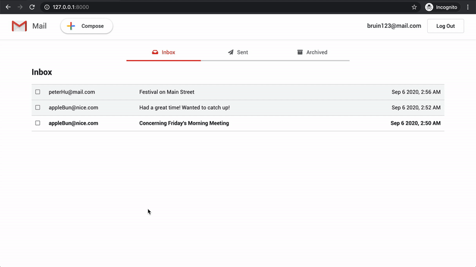
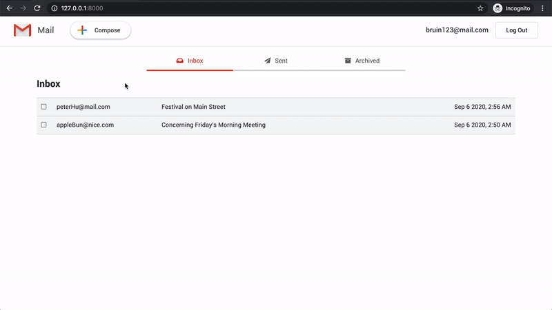
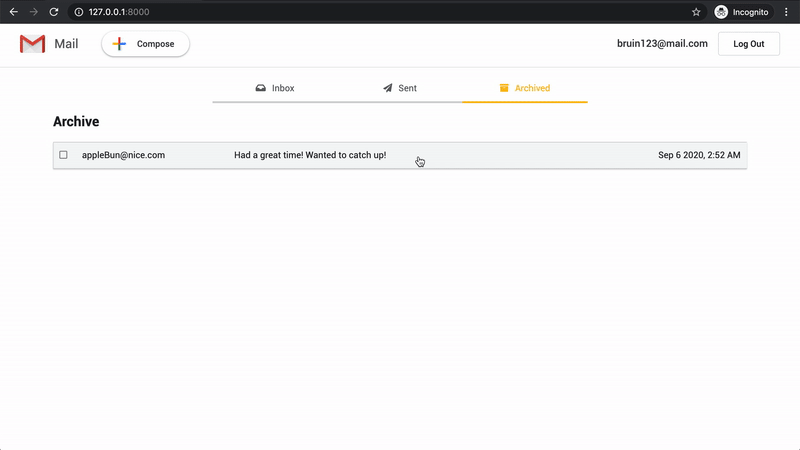

# Mail
An email web application similar in design and function to Google's [Gmail](https://www.google.com/intl/en-GB/gmail/about/). Django is the main framework used for this project.

## Overview
Mail is the third project for Harvard CS50's Web Programming with Python and JavaScript course. The project specifications are listed [here](https://cs50.harvard.edu/web/2020/projects/3/mail/).

### Project Demos
A [full demo of my project](https://www.youtube.com/watch?v=o1HasFr7RUw) can be viewed on YouTube along with all [other CS50 Web Projects](https://www.youtube.com/playlist?list=PLQY6pPQn_frvN_dpoEw7uMP6D1Uzxp99n).

Note the quality of the clips below may be low due to conversion from video to GIF format.  

**Login and register**  

  **Email details**  

  **Compose email**  

  **Archive email**  

### Architecture
**Frontend**
- Languages: 
 	* JavaScript
	* HTML
	* CSS
- Main Framework/Libraries:
 	* [Django Templates](https://docs.djangoproject.com/en/3.1/ref/templates/language/)
	* [Bootstrap](https://getbootstrap.com/)

**Backend**
- Language: 
	* Python
- Main Framework/Libraries:
 	* [Django](https://www.djangoproject.com/)

**Database**
- [SQLite](https://www.sqlite.org/index.html)

## Bug Reports and Improvements
If you experience any bugs or see anything that can be improved or added, please feel free to [open an issue](https://github.com/PeterBohai/mail/issues) here or simply contact me through any of the methods below. Thanks in advance!

Email: peterbohai@gmail.com  
Linkedin: https://www.linkedin.com/in/peterhu08
